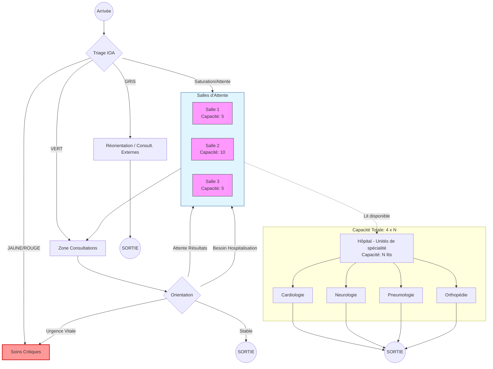

```mermaid
graph TD
    %% Entrée et Triage Direct
    Start((Arrivée)) --> IOA{Triage IOA}

    %% Flux Directs depuis Triage
    IOA -->|GRIS| Reorient[Réorientation / Consult. Externes]
    IOA -->|JAUNE/ROUGE| Critical[Soins Critiques]
    IOA -->|VERT| Consult[Zone Consultations]
    IOA -->|Saturation/Attente| SA

    %% Réorientation vers Sortie
    Reorient --> Out1((SORTIE))

    %% Salles d'Attente
    subgraph SA [Salles d'Attente]
        SA1[Salle 1<br/>Capacité: 5]
        SA2[Salle 2<br/>Capacité: 10]
        SA3[Salle 3<br/>Capacité: 5]
    end

    %% Flux depuis Salles d'Attente
    SA --> Consult

    %% Soins et Décisions
    Consult --> Decision{Orientation}
    
    %% Note: Suppression de la flèche Critical -> Decision selon consigne

    %% Issues de la décision
    Decision -->|Attente Résultats| SA
    Decision -->|Stable| Home((SORTIE))
    Decision -->|Besoin Hospitalisation| SA
    Decision -->|Urgence Vitale| Critical

    %% Transfert vers l'Hôpital
    SA -.->|Lit disponible| Units[Hôpital - Unités de spécialité<br/>Capacité: N lits]
    
    subgraph Unites_Aval [Capacité Totale: 4 x N]
        Units --> Cardio[Cardiologie]
        Units --> Neuro[Neurologie]
        Units --> Pneumo[Pneumologie]
        Units --> Ortho[Orthopédie]
    end

    %% Sorties finales
    Cardio & Neuro & Pneumo & Ortho --> Out3((SORTIE))

    %% Style
    style SA1 fill:#f9f,stroke:#333
    style SA2 fill:#f9f,stroke:#333
    style SA3 fill:#f9f,stroke:#333
    style Critical fill:#ff9999,stroke:#cc0000,stroke-width:2px
    style SA fill:#e1f5fe,stroke:#01579b
```
