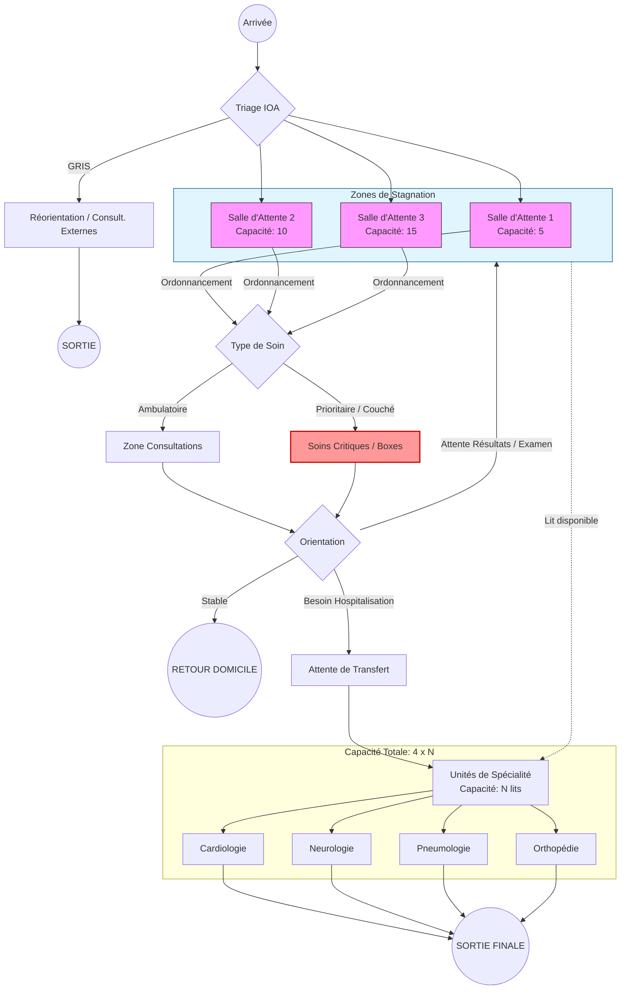

```mermaid
graph TD
    %% Entrée et Triage
    Start((Arrivée)) --> IOA{Triage IOA}

    %% Réorientation
    IOA -->|GRIS| Reorient[Réorientation / Consult. Externes]
    Reorient --> Out1((SORTIE))

    %% Salles d'Attente (Capacités strictes)
    IOA --> SA1[Salle d'Attente 1<br/>Capacité: 5]
    IOA --> SA2[Salle d'Attente 2<br/>Capacité: 10]
    IOA --> SA3[Salle d'Attente 3<br/>Capacité: 15]

    subgraph Zones_Attente [Zones de Stagnation]
        SA1
        SA2
        SA3
    end

    %% Flux vers Prise en Charge
    SA1 & SA2 & SA3 -->|Ordonnancement| Care{Type de Soin}

    Care -->|Ambulatoire| Consult[Zone Consultations]
    Care -->|Prioritaire / Couché| Critical[Soins Critiques / Boxes]

    %% Boucles et Issues
    Consult & Critical --> Decision{Orientation}
    
    Decision -->|Attente Résultats / Examen| Zones_Attente
    Decision -->|Stable| Home((RETOUR DOMICILE))
    Decision -->|Besoin Hospitalisation| Wait[Attente de Transfert]

    %% La flèche directe de stagnation vers les unités (Attente de lit)
    Zones_Attente -.->|Lit disponible| Units

    %% Unités Aval (Capacité variable N)
    Wait --> Units[Unités de Spécialité<br/>Capacité: N lits]
    
    subgraph Unites_Aval [Capacité Totale: 4 x N]
        Units --> Cardio[Cardiologie]
        Units --> Neuro[Neurologie]
        Units --> Pneumo[Pneumologie]
        Units --> Ortho[Orthopédie]
    end

    %% Sorties
    Cardio & Neuro & Pneumo & Ortho --> Out3((SORTIE FINALE))

    %% Style
    style SA1 fill:#f9f,stroke:#333
    style SA2 fill:#f9f,stroke:#333
    style SA3 fill:#f9f,stroke:#333
    style Critical fill:#ff9999,stroke:#cc0000,stroke-width:2px
    style Zones_Attente fill:#e1f5fe,stroke:#01579b
```
