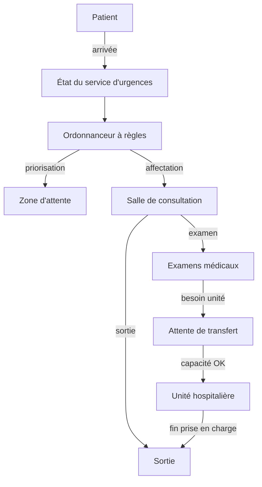

# Modèle du système - Logistique des urgences (sans IA)

## Objectif du document

Ce document décrit le **modèle cœur du système** du projet `emergency_manager`, **indépendamment de toute composante d'intelligence artificielle**.

Ses objectifs sont de :

- formaliser les entités, états, contraintes et règles régissant un service d'urgences,
- fournir une base déterministe, explicable et vérifiable,
- servir de fondation stable pour l'intégration ultérieure du machine learning et des LLM.

> **Point clé**  
> Toutes les décisions décrites dans ce document peuvent être prises **sans IA**. Les briques d'IA viennent **augmenter** le système, jamais s'y substituer.

---

## 1. Périmètre et hypothèses

Le système modélisé représente un **service d'urgences unique**  disposant d'un ensemble **fini de ressources** (salles, personnel, unités) et fonctionnant sous des **contraintes organisationnelles strictess**.

Le **diagnostic médical** est explicitement hors périmètre. Le système traite uniquement de **logistique, de priorisation et de gestion des flux**.

---

## 2. Entités principales

### 2.1 Patient

Le patient est l'entité centrale du système. Pour permettre l'exploitation par les modèles de ML, les attributs sont typés.

**Attributs**

- `id` : identifiant unique
- `niveau_gravite` : valeur catégorielle numérique pour le ML :
    - **3 - ROUGE** : urgence vitale.
    - **2 - JAUNE** : urgent non vital.
    - **1 - VERT** : non urgent.
    - **0  - GRIS** : orientation extérieure / ne nécessite pas de prise en charge aux urgences.
- `heure_arrivee` : timestamp d'arrivée.
- `etat_courant` : état issu de la machine à états (voir section 3).
- `localisation_courante`
- `specialité_requise` : cardiologie, neurologie, pneumologie, orthopédie, aucune.
- `temps_attente`
- `historique` : transitions d'états.
- `score_priorite`: calculé dynamiquement (gravité + temps d'attente)

---

### 2.2 Ressources

Les ressources sont **limitées** et **partagées**. Leur occupation définit l'état de stress du système.

### a) Ressources humaines

- 1 médecin (Consultation)
- 1 infirmier (Triage)
- 2 infirmiers (Salles)
- 2 aide-soignants

Chaque ressource humaine possède :

- un état de disponibilité,
- des contraintes d'affectation (pas de présence simultanée en plusieurs lieux).

#### b) Ressources physiques

- 3 salles d'attente
- 1 salle de consultation
- 1 salle de soins critiques
- unités hospitalières (cardiologie, pneumologie, neurologie, orthopédie)

Chaque unité est caractérisée par :

- une capacité maximale (ex.: 5 lits),
- un seuil d'alerte (**90%**) qui déclenche des logs de saturation.

---

### 2.3 Service d'urgences (état global)

Le service d'urgences est modélisé comme un **conteneur d'état global** regroupant :

- l'ensemble des patients actifs,
- l'ensemble des ressources disponibles,
- le temps courant de la simulation.

Cet état constitue la **source unique de vérité** pour toutes les décisions.

---

## 3. Cycle de vie et états des patients

Chaque patient suit un **cycle de vie à états finis**. Chaque transition est logguée (`logs/decisions.log`) pour l'explicabilité.

### 3.1 États possibles

- `ARRIVÉ`
- `EN_ATTENTE`
- `EN_CONSULTATION`
- `EN_EXAMEN`
- `EN_ATTENTE_TRANSFERT`
- `EN_UNITÉ`
- `SORTI`
- `ORIENTÉ_EXTÉRIEUR` (cas GRIS)

---

### 3.2 Transitions d'états

Les transitions dépendent :

- du niveau de gravité,
- de la disponibilité des ressources,
- des contraintes organisationnelles.

Exemples de transitions :

- `ARRIVÉ` → `EN_ATTENTE` (Triage)
- `EN_ATTENTE` → `EN_CONSULTATION` (Affectation médecin + box)
- `EN_CONSULTATION` → `EN_EXAMEN` (Si besoin d'investigation)
- `EN_CONSULTATION` → `EN_ATTENTE_TRANSFERT` (Décision d'hospitalisation)
- `EN_ATTENTE_TRANSFERT` → `EN_UNITÉ` (Transfert effectif vers spécialité)
- `EN_CONSULTATION` → `SORTI`
- `EN_UNITÉ` → `SORTI`

---

## 4. Contraintes organisationnelles (Règles strictes)

Les contraintes suivantes sont **strictes** :

1. **Validation médicale** : Un patient doit être passé par l'état `EN_CONSULTATION` avant tout transfert vers une unité.
2. **Capacité des unités** : Une unité hospitalière doit confirmer une **capacité disponible** avant d'accepter un patient, i.e. aucun transfert vers `EN_UNITÉ` n'est possible si la capacité de l'unité est à 100% auquel cas le patient reste en `EN_ATTENTE_TRANSFERT`.
3. **Ressources humaines**

   - Une salle de consultation ne peut fonctionner sans médecin superviseur.
   - Un box occupé par un patient doit être attaché à un infirmier disponible.
   - Aucune ressource ne peut être simultanément à deux endroits.
4. Un infirmier ne peut quitter une salle supervisée au-delà d'une durée maximale.
5. **Temps de transport fixes** :

   - consultation : 5 minutes
   - transfert unité : 45 minutes

Toute décision violant une contrainte est **invalide**.

---

## 5. Règles de priorité et d'ordonnancement

### 5.1 Ordre de priorité

À chaque cycle (tick de simulation), l'ordonnanceur :
1. **Priorise** : Trie les patients `EN_ATTENTE` par `niveau_de_gravite` (descendant : ROUGE > JAUNE > VERT > GRIS) puis par `temps_attente` (descendant à gravité égale).
2. **Affecte** : Assign les boxes libres aux patients les plus prioritaires.
3. **Vérifie les blocages** : Identifie les patients bloqués en `EN_ATTENTE_TRANSFERT` par manque de lits en aval.

Les patients **GRIS** sont immédiatement orientés hors du système.

---

### 5.2 Logique d'ordonnancement (baseline)

À chaque étape décisionnelle :

1. Mise à jour de l'état global
2. Identification des patients éligibles
3. Identification des ressources disponibles
4. Application des règles de priorité
5. Exécution des transitions valides

Cette logique définit le **scheduler déterministe de référence**.

---

## 6. Comportement du système sans IA

En l'absence de toute IA, le système :

- repose exclusivement sur des règles explicites,
- produit des résultats déterministes et reproductibles,
- sert de référence pour évaluer l'apport des briques d'IA.

Ce comportement constitue le **baseline explicable** du projet.

---

## 7. Interaction avec les briques d'IA (conceptuelle)

Les briques d'IA pourront :

- **observer** l'état du système,
- **estimer** des risques ou délais,
- **expliquer** les décisions prises.

Elles ne pourront **jamais contourner** :

* les états définis,
* les contraintes organisationnelles,
* les règles d'ordonnancement décrites ici.

---

## 8. Métriques et Indice de Saturation

Le système calcule un **Indice de Saturation (IS)** servant de base à la classification ML :
- **Stable** : IS ≤ 1.0 (Boxes disponibles).
- **Tendu** : 1.0 ≤ IS < 2.0 (Files d'attente en formation).
- **Critique** : IS ≥ 2.0 ou saturation d'une unité spéciale.

---

## 9. Traçabilité et Explicabilité

Chaque événement système génère une entrée structurée :

`[TIMESTAMP] [EVENT_TYPE] [PATIENT_ID] [DESCRIPTION] [DECISION_REASON]`

*Exemple : "Patient PO1 déplacé en Box 1. Raison : Gravité ROUGE, priorité maximale."*

Ces logs permettent au LLM de répondre à la question : *"Pourquoi ce patient attend-il encore ?*

## 10. Diagramme global du système

Le diagramme suivant synthétise les interactions principales.

---

## 11. Principes de conception

- Modélisation explicite des états
- Base déterministe et explicable
- Séparation stricte des responsabilités
- IA comme **outil d'augmentation**, jamais comme autorité
- Traçabilité des décisions

---

## 12. Limites du modèle

- Parcours médicaux simplifiés
- Pas de variabilité comportementale humaine
- Pas de pannes ou absences imprévues
- Pas de diagnostic médical

Ces limites sont **volontaires** et cohérentes avec le cadre pédagogique.

---

## 13. Rôle de ce document dans le projet

Ce document définit la **logique de référence** du système et contraint toutes les briques d'IA.

Tout comportement inattendu devra être expliqué **au regard de ce modèle**.
